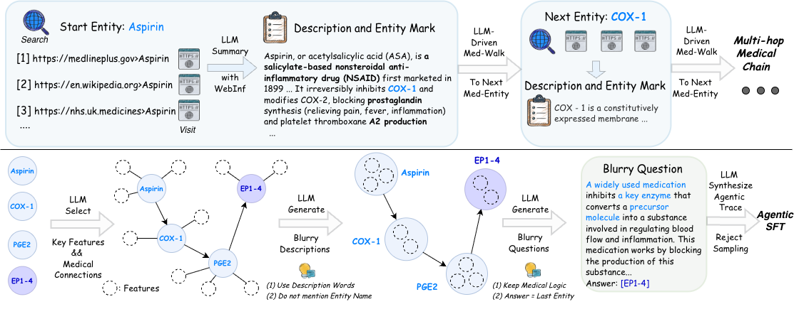
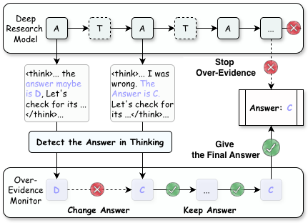

# DeepMed Building a Medical DeepResearch Agent via Multi-hop Med-Search Data and Turn-Controlled Agentic Training & Inference
---

### Figure 1 — General vs Medical Search + DeepMed Gains
> **(up)** General search tasks typically provide definitive answers online, but medical tasks are different; while online information can assist, the final answer relies on medical reasoning **(up)**.  
> **(down)** **DeepMed** shows significant improvements over its base reasoning model on medical benchmarks, and outperforms larger medical reasoning model and general DR models **(down)**.

<p align="center">
  
</p>

### Figure 2 — Med-Search Multi-hop Data Synthesis Workflow
> The multi-hop Med-Search data synthesis workflow for Agentic SFT of **DeepMed**.  
> The top panel illustrates how we synthesize multi-hop medical chains that emphasize logical relations by leveraging multi-source web evidence.  
> The bottom panel shows how these chains are transformed into Med-Search QA.



### Figure 3 — Rollout Reward Evaluation
> A full rollout and its reward evaluation are shown. Only segments inside the solid boxes contribute to the loss.  
> Incorrect format or answer receives zero reward, and even correct rollouts are penalized for excessive rounds.

<p align="center">
  
</p>

### Figure 4 — Workflow of the `Over-Evidence` Monitor
> The workflow of `Over-Evidence` monitor.

<p align="center">
  
</p>


# DeepMed API Configuration

## Required APIs

### 1. Serper (Web Search)
```bash
export SERPER_API_KEYS="your-key"
```
Get from: [serper.dev](https://serper.dev/)

### 2. Jina (Web Reader)
```bash
export JINA_API_KEYS="your-key"
```
Get from: [jina.ai](https://jina.ai/)

### 3. Summary Model
```bash
SUMMARY_API_BASE="https://api.openai.com/v1"
SUMMARY_API_KEY="your-key"
SUMMARY_MODEL_NAME="gpt-4o"
```

### 4. Inference Model
```bash
BASE_URLS="http://localhost:8000/v1"
```
Local vLLM server or any OpenAI-compatible API.

---

## Quick Start

```bash
# Search APIs
export SERPER_API_KEYS="your-serper-key"
export JINA_API_KEYS="your-jina-key"

# Summary Model (OpenAI)
SUMMARY_API_BASE="https://api.openai.com/v1"
SUMMARY_API_KEY="sk-xxx"
SUMMARY_MODEL_NAME="gpt-4o"

# Inference Model
BASE_URLS="http://localhost:8000/v1"

# Dataset
INPUT_JSONLS=("/path/to/dataset.jsonl")
```
---
